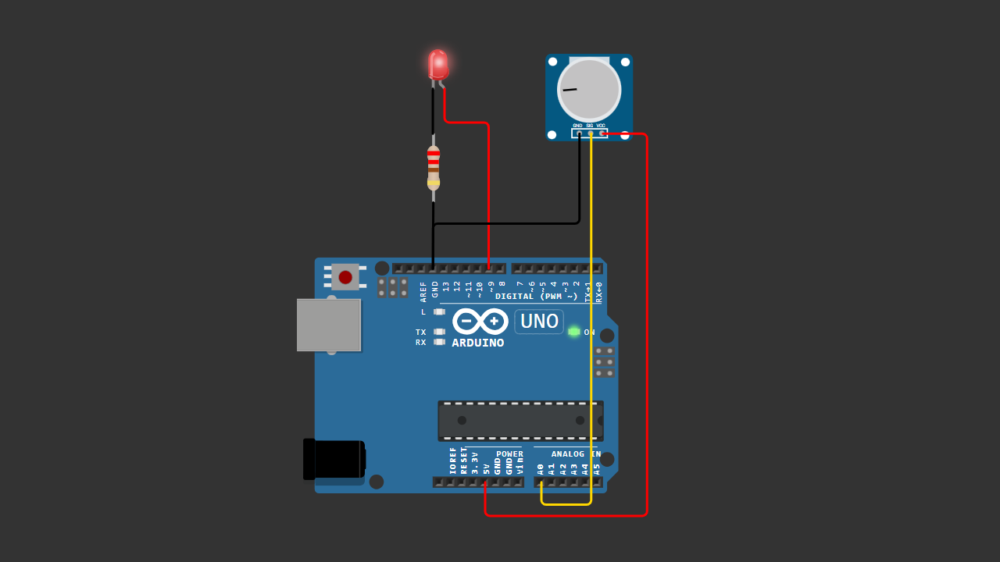

# Arduino Potentiometer LED Brightness

This project demonstrates how to control LED brightness using a potentiometer and PWM on Arduino.

## 📌 Project Overview

The analog value from the potentiometer (0–1023) is read using `analogRead()`,  
then converted into a PWM value (0–255) using the `map()` function.  
The LED brightness is controlled using `analogWrite()`.

This is a fundamental beginner Arduino project to understand:

- Analog Input
- PWM Output
- map() Function
- LED Brightness Control

---

## 🔧 Components Required

- Arduino Uno (or compatible board)
- 10K Potentiometer
- LED
- 220 ohm Resistor
- Breadboard
- Jumper wires

---

## 🔌 Wiring

### Potentiometer:
- Left pin → 5V  
- Right pin → GND  
- Middle pin → A0  

### LED:
- Anode (long leg) → Pin 9  
- Cathode (short leg) → 220 ohm resistor → GND  

---

## 📷 Wiring Diagram

> Make sure your wiring matches the diagram above before uploading the code.

---

## 💻 Arduino Code

You can download the Arduino sketch here:

[Download Arduino Code](Arduino_Potentiometer_LED_Brightness.ino)

Or open the `.ino` file directly inside this repository.

---

## 🎥 Video Tutorial

Watch the full tutorial on YouTube:

---

## 📜 License

This project is open-source and free to use for educational purposes.
